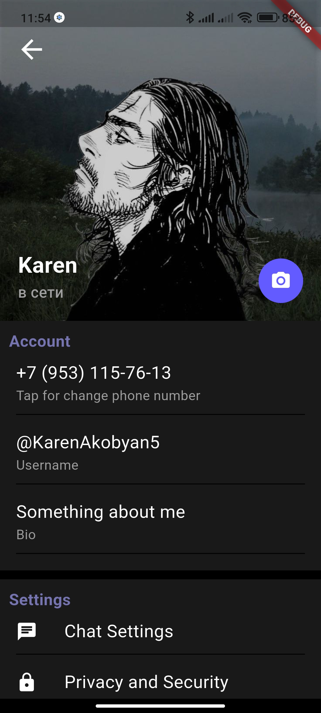
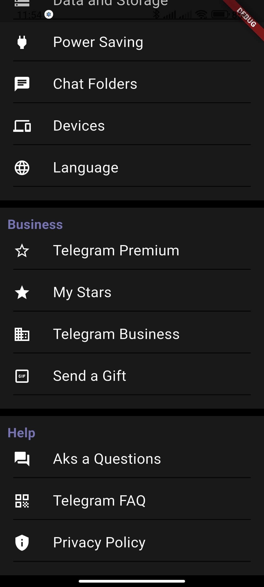

# Экран профиля (Telegram-style)

Этот проект демонстрирует реализацию экрана профиля в стиле Telegram на Flutter.  
Экран включает:

- Аватар пользователя
- Основную информацию: имя, телефон, username, био
- Меню настроек с иконками и подпунктами
- Возможность тапнуть на элементы для дальнейшей обработки

---

## Скриншоты

Главный экран профиля:



Меню настроек:



---

## Технологии

- Flutter 3.x
- Dart
- Material Design Widgets
- Custom Widgets для строк меню и аватара

---

## Установка и запуск

1. Клонируйте репозиторий:
```bash
git clone https://github.com/GhOsTiK56/Flutter_verstka_screen_settings.git